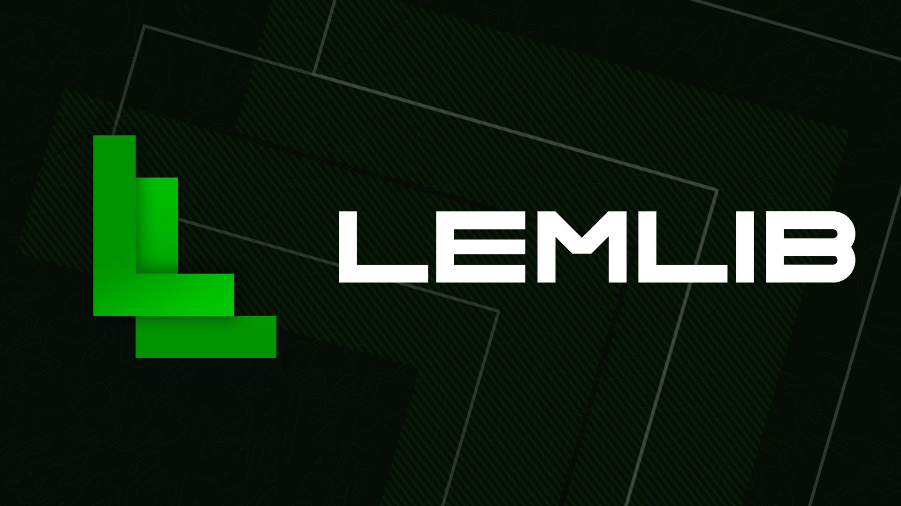

    
    
    
    
    

Welcome to LemLib! This open-source PROS template aims to introduce common algorithms like Pure Pursuit and Odometry for new and experienced teams alike.

The creation of this template was inspired by [EZ-Template](https://github.com/EZ-Robotics/EZ-Template) and [OkapiLib](https://github.com/OkapiLib/OkapiLib). We aim to develop a library that strikes a balance between ease-of-use, akin to that of EZ-Template, and comprehensive functionality, similar to that of OkapiLib.

> Want a place to chat with the devs and other users? Join our [Discord server](https://discord.gg/pCHr7XZUTj).

## License
This project is licensed under the MIT license. Check [LICENSE](https://github.com/LemLib/LemLib/blob/master/LICENSE) for more details.

## Features
- Generic PID class
- Odometry
- Odom turn to face point
- [Boomerang controller](https://www.desmos.com/calculator/sptjw5szex)
- Pure Pursuit
- Motion Chaining
- Driver Control

## Example Project
You can find a fully annotated example project [here](https://github.com/LemLib/LemLib/blob/stable/src/main.cpp).

## Tutorials
The [tutorials](https://lemlib.readthedocs.io/en/v0.5.0/tutorials/1_getting_started.html) provide a detailed walkthrough through all the features of LemLib. It covers everything from installation to Path Following:

## FAQ
_**1. Help! Why is my controller vibrating?**_
If your controller vibrated more than once, your inertial sensor calibration failed.
Check if its connected to the right port and try again.

_**2. What drivetrains are supported?**_
Only tank/differential.
This is not going to change until other drivetrains are competitive.

_**3. Do I need tracking wheels?**_
No, but it is recommended.
You should absolutely have a horizontal tracking wheel if you don't have traction wheels, and you have to spend extra effort tuning your movements to prevent any wheel slip.

_**4. Do I need an inertial sensor?**_
No, but it is highly recommended.
The one exception to this would be if you have 2 parallel tracking wheels which are tuned well and are perfectly square. LemLib will work without it, but the accuracy will be compromised. 

_**5. Do I need an SD card?**_
As of v0.5.0, no SD card is necessary.

_**6. What are the units?**_
The units are inches and degrees.
In a future release, Qunits will be used so you can use whatever units you like.

_**7. Is LemLib V5RC legal?**_
Yes.
Per the RECF student-centred policy, in the context of third-party libraries.
> Students should be able to understand and explain the code used on their robots

In other words, you need to know how LemLib works. You don't need to know the details like all the math, just more or less how the algorithm works. If you want to learn more about LemLib, you can look through the documentation and ask questions on our Discord server.

## Documentation
Check out the [Documentation](https://lemlib.readthedocs.io/en/v0.5.0/index.html).

## Contributing
Want to contribute? Please read [CONTRIBUTING.md](https://github.com/LemLib/LemLib/blob/master/.github/CONTRIBUTING.md) and join our [Discord server](https://discord.gg/pCHr7XZUTj).

## Code of Conduct
See the [Code of Conduct](https://github.com/LemLib/LemLib/blob/master/.github/CODE_OF_CONDUCT.md) on how to behave like an adult.
