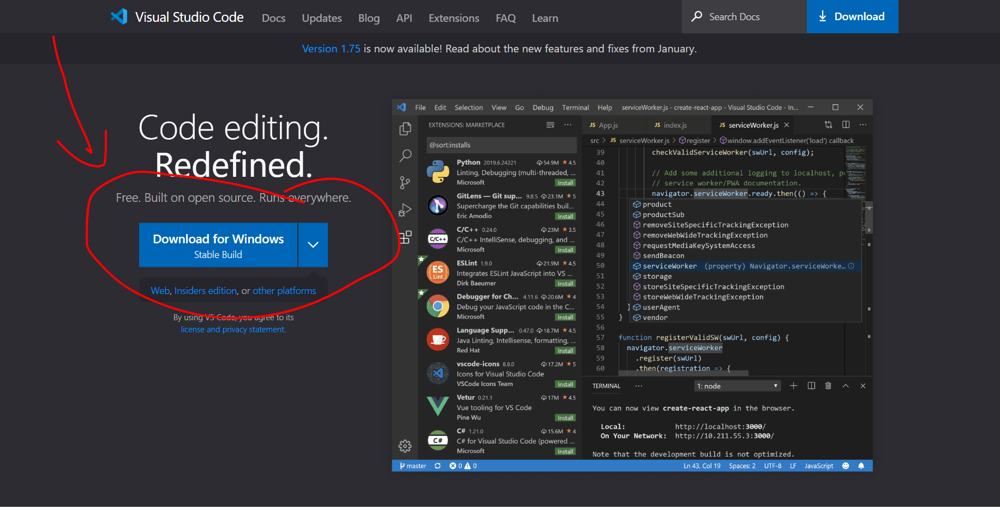
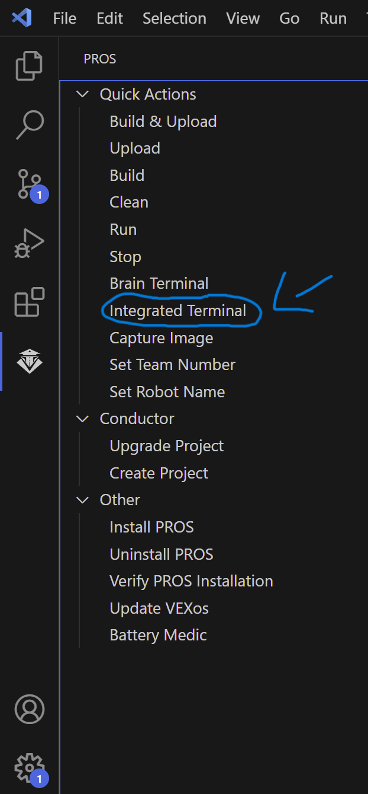

# 01 - Getting Started

## **Introduction**

Welcome to LemLib! This tutorial will walk you through the basics of LemLib and how to get everything set up.

 

## **Installation - Development Environment**

LemLib is a [PROS](https://pros.cs.purdue.edu) template, so you can use it with any text editor. However, we recommend using Visual Studio Code, as it has the best support for PROS.

To install visual studio code, go to [https://code.visualstudio.com](https://code.visualstudio.com) and download the installer for your operating system

 

Once you have installed it, open it and install the PROS extension. You can do this by clicking typing `Ctrl+Shift+X`, searching for "pros", and clicking the install button.
 

And finally, we can create a new project. Navigate to the new PROS tab on the left, and click the "Create New Project" button. Select a folder, a name, v5, and when asked to select a version, select "latest".

Now we can install LemLib!
 
 

## **Installation - LemLib Template**

To install LemLib, you need to download its zip file from [here](https://github.com/SizzinSeal/LemLib/releases/download/v0.4.0/LemLib@0.4.0.zip). Next you need to drag the zip file into your pros project folder. Once you have done that, open the pros integrated terminal by selecting the pros icon on the left, and clicking `integrated terminal` 
 

Next, you need to run the following command in the terminal: `pros c fetch LemLib@0.4.0.zip; pros c apply LemLib@0.4.0`. Finally, you need to put `#include "lemlib/api.hpp"` at the top of your main.cpp file. Now you are ready to start using LemLib!

[Next Tutorial](2_setting_up_the_chassis.md)